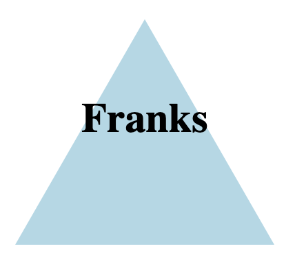

# LogoLabs:   Logo Generator

## Description 
LogoLabs is a command-line application that enables users to generate logos for their brand or company by inputting information on shapes, colors and text.  The application supports three types of shapes, including squares, circles and triangles and allows users to specify the color of the shape using a hexadecimal value or a pre-defined color name.  Users are prompted to add text to the logo and the color of the text.

The LogoLabs application is user-friendly and provides clear instructions on how to use the application.  Once the user inputs the necessary information, LogoLabs generates a high-quality logo in an SVG format.  This allows users to easily incorporate their logo into their marketing materials, website and social media profiles.

Overall, LogoLabs is a powerful tool for anyone who wants to create a professional-looking logo for their brand or company quickly and easily. With its simplistic approach to creating your new logo, LogoLabs is an excellent choice for both beginners and experienced designers alike.

## Table of Content
- ScreenCastify demo link
- Shape Example
- Installation
- Usage
- Built with...
- Attributes and Acknowledgements
- License

## ScreenCastify demo link
[LogoLabs screencastify demo](https://watch.screencastify.com/v/nHayL21MypgXVWaBix8T)

## Shape Example

## Installation
1. Copy SSH key from my GitHub repository(Listed at the end of this README) then clone to your local system.
2. Install node by copying and pasting the code `npm init -y` in your terminal
3. Install the inquirer package by copying and pasting the code `npm i inquirer` in your terminal
4. Install jest by copying and pasting the code `npm install --save-dev jest`

## Usage
1. Open the index.js file in your terminal before you've completed the installation, including installing the necessary applications.
2. Run `node index.js` to start the application
3. Answer questions when prompted for Shape, color of shape, brand or company name and text color
4. Open the new SVG file that was created in the browser and review
5. After review, if you are not happy with the first render, feel free to repeat the process above until you settle on "The One"

## Built with...
  This application was built with JavaScript, Node.js, Express.js and OOP concepts learned in the UT Austin Bootcamp. The following node packages where used in this project as well...
[Inquirer Package](https://www.npmjs.com/package/inquirer/v/8.2.4)
[Jest Package](https://www.npmjs.com/package/jest)

## Attributes and Acknowledgements
  Help by three Ask BCS tutors, Will, Royce and Mark.  Help was given by tutors Matthew Calimbas and Mila Hose.  Google, MDN docs, W3 schools and Chat gpt where consulted on almost every inch of this project to help understand the code I was writing.

## License

